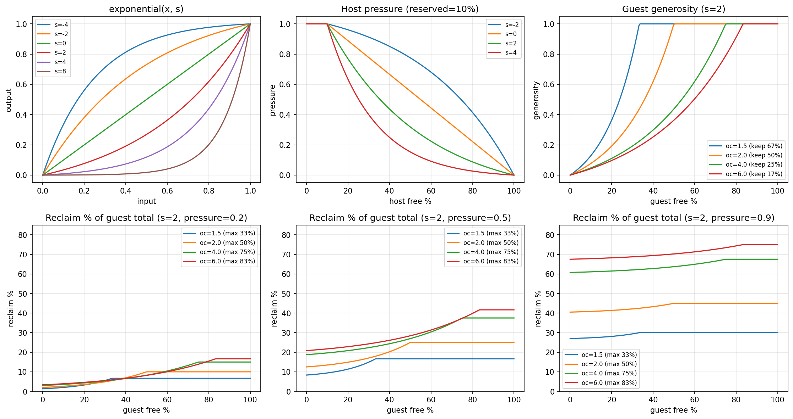

# Schnüffelstück

_Ein selbsttätiger Entlüfter, in Fachkreisen auch Schnüffelstück genannt._

---

A KubeVirt sidecar that dynamically manages VM memory using QEMU balloon devices.
It monitors host and guest memory pressure and automatically inflates or deflates
the balloon to balance memory across VMs on the same node.

## How It Works

Schnüffelstück runs as a [hook sidecar](https://kubevirt.io/user-guide/user_workloads/hook-sidecar/) inside the `virt-launcher` pod. On VM startup it:

1. Injects a QMP (QEMU Monitor Protocol) chardev into the domain XML via KubeVirt's `OnDefineDomain` hook
2. Connects to the QEMU monitor socket
3. Runs a control loop that samples host and guest memory, computes a balloon target, and applies it via QMP

```
┌────────────────────── virt-launcher pod ───────────────────────┐
│                                                                │
│  ┌──────────────┐    QMP socket   ┌─────────────────────────┐  │
│  │ schnüffel-   │◄───────────────►│        QEMU / VM        │  │
│  │ stück        │                 │  ┌───────────────────┐  │  │
│  │              │                 │  │  virtio-balloon   │  │  │
│  │  collect ─┐  │                 │  │  driver           │  │  │
│  │  decide   │  │                 │  └───────────────────┘  │  │
│  │  apply  ◄─┘  │                 └─────────────────────────┘  │
│  └──────┬───────┘                                              │
│         │ /proc/meminfo                                        │
│         ▼                                                      │
│     host memory                                                │
└────────────────────────────────────────────────────────────────┘
```

## Quick Start

### Prerequisites

- KubeVirt with the **Sidecar** feature gate enabled:
  ```yaml
  apiVersion: kubevirt.io/v1
  kind: KubeVirt
  spec:
    configuration:
      developerConfiguration:
        featureGates:
          - Sidecar
  ```
- The guest OS must have a **virtio-balloon driver** (Linux has it built-in, Windows needs [virtio-win](https://fedorapeople.org/groups/virt/virtio-win/direct-downloads/))

### Deploy

Add the hook sidecar annotation to your VMI and configure guest memory:

```yaml
apiVersion: kubevirt.io/v1
kind: VirtualMachineInstance
metadata:
  name: my-vm
  annotations:
    hooks.kubevirt.io/hookSidecars: |
      [{
        "image": "ghcr.io/grandeit/schnueffelstueck:latest",
        "imagePullPolicy": "Always",
        "command": ["/schnueffelstueck", "--log-level", "debug"]
      }]
    schnueffelstueck/controller: "pressure"
    schnueffelstueck/guest-overcommit: "2.0"
spec:
  domain:
    resources:
      requests:
        memory: 6Gi
    memory:
      guest: 12Gi
```

- `memory.guest` is the VM's full RAM size (what QEMU allocates)
- `resources.requests.memory` is the Kubernetes pod resource request, used for scheduling and cgroup limits - set it to `guest / overcommit` so the pod only reserves the minimum it needs
- The balloon floor (minimum VM size) is enforced by schnüffelstück's `guest-overcommit` setting
- The `command` field is optional - omit it to use the default log level (`info`)

> **Note:** KubeVirt automatically adds ~300 MiB of memory overhead to the pod's resource requests for QEMU, libvirt, and virt-launcher processes. You don't need to account for this - just set `requests.memory` to the balloon floor you want.

> **Note:** When using a `VirtualMachine` resource instead of a bare `VirtualMachineInstance`, place the annotations in the VMI template:
> ```yaml
> apiVersion: kubevirt.io/v1
> kind: VirtualMachine
> metadata:
>   name: my-vm
> spec:
>   template:
>     metadata:
>       annotations:
>         hooks.kubevirt.io/hookSidecars: |
>           [{"image": "ghcr.io/grandeit/schnueffelstueck:latest"}]
>         schnueffelstueck/controller: "pressure"
>     spec:
>       domain:
>         # ...
> ```

## Controllers

### `log` (default)

Logs host and guest memory statistics without taking any action. Useful for observing memory behavior before enabling ballooning.

### `pressure`

Adjusts the balloon based on two signals:

- **Pressure** (0–1): how urgently the host needs memory, derived from host free % and an exponential curve
- **Generosity** (0–1): how willing the guest is to give up memory. A guest is fully generous (1.0) when all its used memory fits inside its reserved floor (`1/overcommit` of total RAM) - meaning everything above the floor is surplus. As the guest uses more memory and exceeds its floor, generosity drops toward 0

As host pressure rises, a lerp override increasingly forces generosity toward 1.0, guaranteeing the host can always reclaim up to the overcommit limit:

```
reclaim = pressure × (generosity + pressure × (1 − generosity)) × maxReclaim × guestTotal
```

Where `maxReclaim = 1 − 1/overcommit` (e.g., 0.5 for overcommit 2).



**Top row**: base exponential function, host pressure vs host free %, and guest generosity vs guest free %.
**Bottom row**: effective reclaim % at pressure 0.2, 0.5, and 0.9 - despite lower generosity, higher overcommit reclaims more because the reclaimable zone is larger. At high pressure the lerp override forces reclaim toward the maximum.

#### Capacity Planning

At maximum pressure, each VM gives up `maxReclaim` of its RAM. The host reserve is guaranteed:

```
max VMs = (host RAM × (1 − hostReservedPct)) / (VM size × (1 / overcommit))
```

Example: 64 GiB host, 10% reserved, 12 GiB VMs, overcommit 2:

```
(64 × 0.9) / (12 × 0.5) = 57.6 / 6 = 9 VMs
```

This is a worst-case guarantee. In normal operation (low pressure), VMs keep more memory.

## Configuration

All settings are VMI annotations with the `schnueffelstueck/` prefix.

### General

| Annotation | Type | Default | Description |
|---|---|---|---|
| `controller` | string | `log` | Controller kind: `log` or `pressure` |
| `interval` | duration | `1s` | Control loop tick interval |
| `dry-run` | bool | `false` | Log decisions without applying them |
| `guest-overcommit` | float | `2.0` | Overcommit ratio. `2.0` = VM keeps at least 50% of its RAM |
| `guest-max-step-pct` | float | `0.1` | Max balloon change per tick (fraction of guest total) |
| `guest-min-step-pct` | float | `0.01` | Dead band - changes smaller than this are skipped |
| `host-reserved-pct` | float | `0.1` | Host free % threshold below which pressure = 1.0 |
| `qemu-stats-period` | int | `1` | Guest balloon stats polling interval in seconds |

### Pressure Controller

| Annotation | Type | Default | Description |
|---|---|---|---|
| `pressure-host-steepness` | float | `2` | Host pressure curve steepness. Higher = lazy until critical |
| `pressure-guest-steepness` | float | `2` | Guest generosity curve steepness. Higher = stingy with surplus |

Setting steepness to `0` gives a linear curve. Negative values make the curve concave (aggressive early, gentle late).

### CLI Flags

| Flag | Default | Description |
|---|---|---|
| `--log-level` | `info` | Log level: `debug`, `info`, `warn`, `error` |